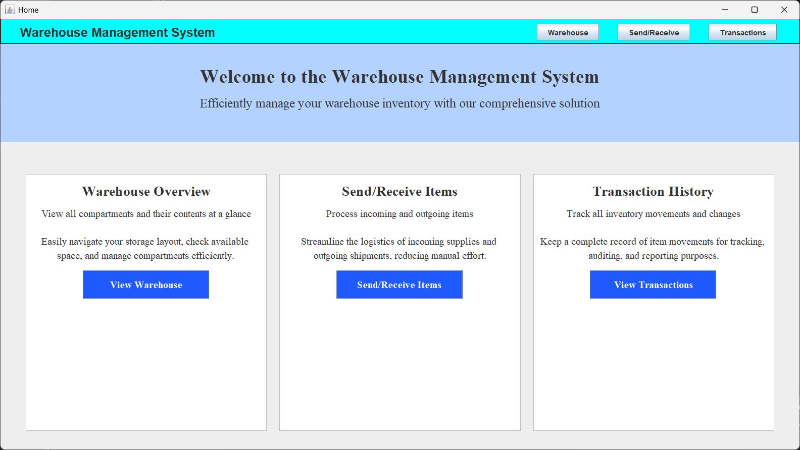
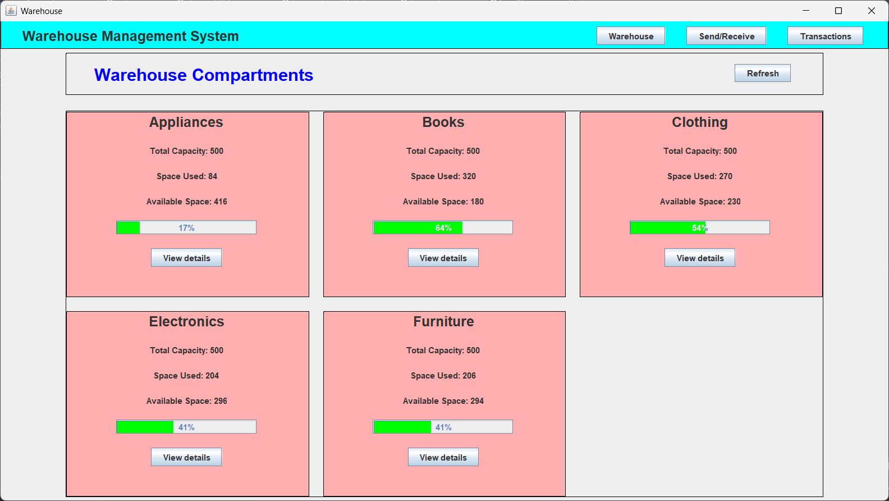
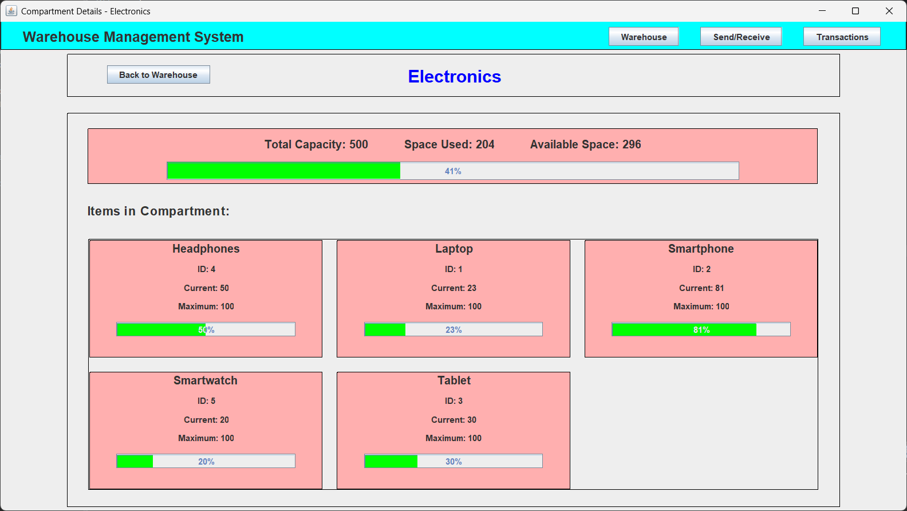
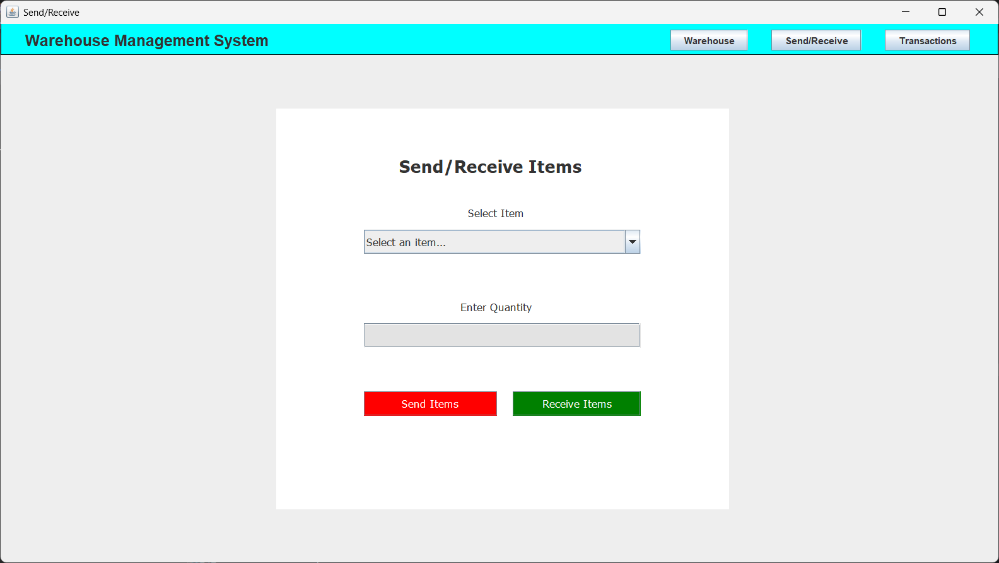
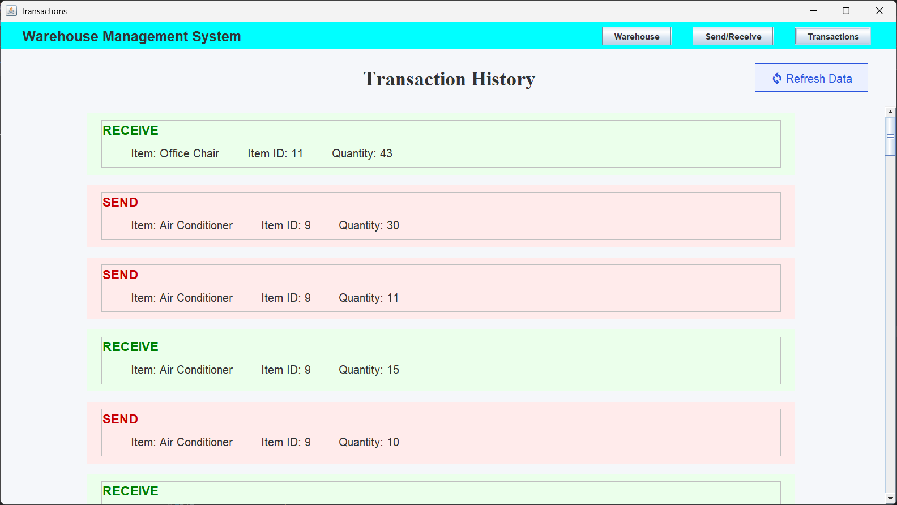

# Warehouse Management System

A Java desktop application for warehouse inventory management, built with Swing.

## About This Project

This application is a Java Swing recreation of the frontend from the [DBMS-Warehouse-System](https://github.com/RishiWaghmare12/DBMS-Warehouse-System) project, which was originally built using React. While the frontend has been reimplemented in Java Swing, the application still makes API calls to the original Node.js backend server deployed by Rishi Waghmare.

## Features

- Warehouse overview with categories and items
- Send/receive items functionality
- Transaction history
- Space utilization tracking

## Screenshots

### Home Page


### Warehouse Overview


### Compartment Detail


### Send/Receive Items


### Transactions History


## Requirements

- Java 23 or higher

## Quick Start

### Option 1: Download Released JAR

1. Download from [Releases](https://github.com/devinxhacker/java_mini_proj/releases)
2. Run: `java -jar warehouse-management-system.jar`

### Option 2: Build from Source

1. Clone the repository:
   ```
   git clone https://github.com/devinxhacker/java_mini_proj.git
   ```
2. Navigate to the project:
   ```
   cd java_mini_proj
   ```
3. Build with Maven:
   ```
   mvn clean install
   ```
4. Run the JAR:
   ```
   java -jar .\target\warehouse-management-system.jar
   ```

### Option 3: Run from Source Code

1. Clone the repository:
   ```
   git clone https://github.com/devinxhacker/java_mini_proj.git
   ```
2. Navigate to the project:
   ```
   cd java_mini_proj
   ```
3. Run Home.java directly:
   - Open in your favorite IDE
   - Run the main method in `src/main/ui/pages/Home.java`
   - Or compile and run from command line:
     ```
     javac -d bin src/main/ui/pages/Home.java
     java -cp bin main.ui.pages.Home
     ``` 